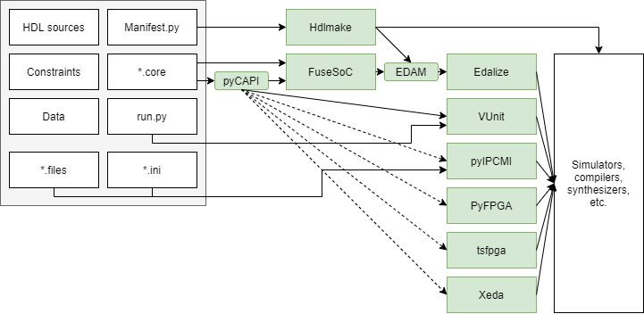

.. _OSVB:API:Core:

Core
####

This section covers the definition of configuration/declaration files for users to describe the sources and parameters
that compose an HDL project.
Several JSON/YAML/INI formats are supported by different tools in the ecosystem.
Here, we don't want to focus as much on the specific file format as we do want to understand the structure of the data.
A Python module is proposed for interacting with those file formats.

Introduction
------------

`FuseSoC <https://hdl.github.io/awesome/items/fusesoc/>`__ is a package manager and build abstraction tool for FPGA/ASIC
development, written in Python. It is based on a declarative data sctructure, defined as a YAML configuration file format
named Core API (CAPI).
The current version 2 of the format is named ``CAPI2`` (see `fusesoc.rtfd.io: ref/capi2 <https://fusesoc.rtfd.io/en/latest/ref/capi2.html>`__).
A single YAML file can be used for defining all the sources and parameters related to multiple tools for simulation,
verification, synthesis, etc.

Initially, FuseSoC was a monolith that allowed interacting with FPGA/ASIC tools directly.
Later, `Edalize <https://hdl.github.io/awesome/items/edalize/>`__ was split, and an API named EDA Metadata (EDAM) was
proposed for the interaction from FuseSoC or other frontends.
`Hdlmake <https://hdl.github.io/awesome/items/hdlmake/>`__ is one of the projects that can use Edalize through EDAM.

Nevertheless, the proposal for funneling all open source project management tools through Edalize didn't engage the
broad open source hardware tooling community. Multiple projects (such as
`VUnit <https://hdl.github.io/awesome/items/vunit/>`__,
`pyIPCMI <https://hdl.github.io/awesome/items/pyipcmi/>`__,
`PyFPGA <https://hdl.github.io/awesome/items/pyfpga/>`__,
`tsfpga <https://hdl.github.io/awesome/items/tsfpga/>`__
or
`Xeda <https://hdl.github.io/awesome/items/xeda/>`__
) provide independent APIs and CLIs for interacting with FPGA/ASIC tools.
Most of them are also standalone monoliths with custom configuration file formats.
Therefore, workflows are not compatible, and users need duplicated configurations for addressing the requirements of
each tool.

There have been some integration efforts; for instance, supporting VUnit scripts as FuseSoC/Edalize targets.
However, there is a paradigm conflict, since FuseSoC expects to be the entrypoint and Edalize is to be the backend.
Therefore, integration of other tools is only conceived as plugins in the already constrained framework.
Doing so breaks the workflows that the user bases of other projects do rely on.

The proposal in this bundle is to provide a reusable Python module named pyCAPI, for reading CAPI files and manipulating
the data through a pythonic API.
pyCAPI allows FPGA/ASIC tool management projects to consume ``*.core`` configuration files non-intrusively, by providing
complementary import APIs.
Thus the CLIs in the existing workflows are preserved, without forcing FuseSoC as a frontend and/or Edalize as a
backend.
Hopefully, pyCAPI reduces the burden for users to try and learn new tools, while developers/maintainers can carefully
analyse possible integration strategies with regard to the other APIs in the architecture.

  Usage of pyCAPI as a utility library for multiple EDA management projects.

FuseSoC does contain some Python code for reading and parsing CAPI2 files (see `olofk/fusesoc: fusesoc/capi2 <https://github.com/olofk/fusesoc/tree/master/fusesoc/capi2>`__).
Unfortunately, it is challenging to work with.
On the one hand, it uses `pyyaml <https://pyyaml.org/>`__ for reading ``*.core`` files as Python dictionaries and lists.
As a result, the procedure for providing Python classes is manual and prone to error.
On the other hand, the format is documented in the sources of the code, but the code itself is undocumented.

Conversely, pyCAPI is a proof of concept based on Python :mod:`python:dataclasses` for direct (un)marshalling of YAML
to/from Python classes.
Hence, the CAPI2 format is not supported as-is yet: some non compliant fields were modified, and the prototype is
limited to reading filesets.
This work-in-progress version of CAPI is marked as ``3``, for avoiding conflicts with existing ``*.core`` files.
Still, pyCAPI does already allow VUnit to read ``*.core`` files for declaring HDL sources and the ``logical_name`` of
the libraries where they need to be compiled.
I.e., it allows providing a working proof of concept, constrainted to the simulation/verification scope of this bundle.

Feedback and contributions for making pyCAPI compatible with and supported by FuseSoC, VUnit, PyFPGA, pyIPCMI, etc. are
very welcome!
`Open an issue <https://github.com/umarcor/osvb/issues/new/choose>`__ or `join the chat <https://gitter.im/hdl/community>`__!

CAPI reference
--------------

.. autoclass:: pyCAPI.IpCoreConfig()

.. autoclass:: pyCAPI.FilesetConfig()

.. autoclass:: pyCAPI.Config()

.. autofunction:: pyCAPI.LoadCoreFile

.. autofunction:: pyCAPI.VUnit.AddCoreFilesets

References
----------

* `yukihiko-shinoda/yaml-dataclass-config <https://github.com/yukihiko-shinoda/yaml-dataclass-config>`__
* `su0.io: Strict YAML deserialization with marshmallow <http://su0.io/2020/08/05/python-strict-yaml-deserialization.html>`__
* `antonblanchard/microwatt: microwatt.core <https://github.com/antonblanchard/microwatt/blob/master/microwatt.core>`__
* `VLSI-EDA/PoC: .pyIPCMI <https://github.com/VLSI-EDA/PoC/tree/master/.pyIPCMI>`__
* `j.mp/openfpga-diagram: Open Source (FOSS) FPGA (EDA) Tooling Interchange Formats + Toolchain parts <https://docs.google.com/document/d/1DWZ0G8vehkuZTPs5N3AQqIvZZtLMGzC8i0MWPRP54O4>`__
* `ghdl/ghdl-language-server#12 <https://github.com/ghdl/ghdl-language-server/issues/12>`__ `ghdl/ghdl-language-server#80 <https://github.com/ghdl/ghdl-language-server/issues/80>`__
* `cocotb[wiki]: Python Test Runner Proposal | Models <https://github.com/cocotb/cocotb/wiki/Python-Test-Runner-Proposal#models>`__.
* `Core HAMMER settings <https://github.com/ucb-bar/hammer/blob/master/src/hammer-vlsi/defaults.yml>`__
* `kactus2/kactus2dev <https://github.com/kactus2/kactus2dev>`__

  * `research.tuni.fi/system-on-chip/tools <https://research.tuni.fi/system-on-chip/tools/>`__
  * `gitter.im/hdl/community?at=6132117a5b92082de1807f54 <https://gitter.im/hdl/community?at=6132117a5b92082de1807f54>`__:
    *"I also worked together with the Kactus2 devs and had monthly meeting for a few years to push that as the preferred
    solution and I've been periodically trying to build a reference design that uses Kactus2+FuseSoC"*.

* `olofkindgren.blogspot.com: IP-XACT: The good, the bad and the outright madness <http://olofkindgren.blogspot.com/2016/11/ip-xact-good-bad-and-outright-madness.html>`__
* `youtube.com: ORPSoCv3 - OpenRISC Project Meeting 2012 <https://www.youtube.com/watch?v=vYJjIoV0G3U>`__
