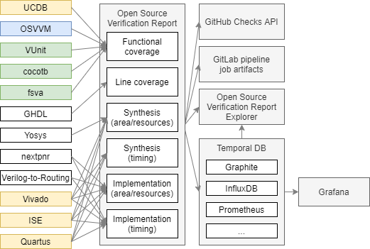

.. _OSVB:API:Logging:

Logging
#######

Unarguably, the most relevant feature of a testing/verification ecosystem is a robust solution for reporting test results
and for providing feedback to the users.
Since most executions are to be run unattended, spotting regressions needs to be reliable and must provide a quick
procedure for reproducing issues locally.
Therefore, logging features are tightly related to :ref:`OSVB:API:Tool` and :ref:`OSVB:API:Runner`.

Terminal
********

In the terminal, VUnit provides a coloured summary of the tests and the results at the end of the execution of a
``run.py`` script.
By default, logging is saved to files and not shown in the terminal.
However, CLI option ``-v`` allows printing the content.
Moreover, VUnit's VHDL library ``logging`` allows using custom loggers with fine grained control of the scope and the
consumers (CSV files and/or display/screen).

.. figure:: https://vunit.github.io/_images/vunit_demo.gif
  :alt: Interactive VUnit session
  :width: 600px
  :align: center

  An interactive VUnit session.

Nonetheless, in complex projects, users do typically handle several run scripts, for testing different units/modules of
the designs.
The recommended approach for those cases is using `pytest <https://docs.pytest.org/>`__, a framework built on top of the
built-in :py:mod:`unittest` unit testing framework in Python.
Similarly to VUnit, pytest provides automatic discovery, marks and hooks for fine grained control of test execution.

Waveforms
*********

The most widespread format for dumping waveforms is Value Change Dump (VCD), defined in the Verilog language (IEEE Std
1364-1995).
Six years later, an Extended VCD (EVCD) was defined in IEEE Std 1364-2001.
VCD is simple and compact, which allowed it to be used in fields other than Verilog simulation tools.
For instance, GHDL supports dumping VCD files.
Since VCD files are text files, some tools use VCDGZ for referring to VCD compressed using zlib/gzip.

VCD/EVCD can be read by multiple open source tools:

* `GTKWave <https://hdl.github.io/awesome/items/gtkwave/>`__
* :ref:`OSVB:Notebook:sigrok`
* `psurply/dwfv <https://github.com/psurply/dwfv>`__
* `wavedrom.com <https://wavedrom.com/>`__, `wavedrom/vcd <https://github.com/wavedrom/vcd>`__ and `zoom <https://github.com/wavedrom/zoom>`__.
* `Nic30/d3-wave <https://github.com/Nic30/d3-wave>`__
* `raczben/fliplot <https://github.com/raczben/fliplot>`__
* `lachlansneff/ligeia <https://github.com/lachlansneff/ligeia>`__
* `yne/vcd <https://github.com/yne/vcd>`__
* `toem/impulse.vscode <https://github.com/toem/impulse.vscode>`__

However, being a 20+ year old format defined for Verilog, VCD has certain limitations:

* Data cannot be accessed randomly, as it has to be sequentially parsed.
* Periodic signals are not compressed, so they take a lot of space.
* File size is huge, because it is plain text.

Anthony J. Bybell, has gathered much knowledge about alternatives through the decades he's been building and maintaining
GTKWave.
It supports FST, LXT, LXT2 and VZT formats.
See appendices C, D and F of the `GTKWave User's Guide <http://gtkwave.sourceforge.net/gtkwave.pdf>`__.
GHDL supports saving/reading waveforms as FST files, which are much smaller than VCD and they handle the same signal
types.

On the other hand, neither VCD nor FST can handle certain signal types from the VHDL language.
There is neither any equivalent in the VHDL LRM.
Tristan Gingold, author of GHDL, implemented a format named GHW for allowing all VHDL types to be dumped.
He also contributed a reader to GTKWave, which allows visualizing them.

.. NOTE::
  GTKWave provides multiple tools for converting waveforms between any of the supported formats.
  That is not trivial because some conversions are lossy or suboptimal.
  See appendix A of the `GTKWave User's Guide <http://gtkwave.sourceforge.net/gtkwave.pdf>`__
  and subdir `gtkwave/gtkwave: gtkwave3-gtk3/src/helpers <https://github.com/gtkwave/gtkwave/tree/master/gtkwave3-gtk3/src/helpers>`__.
  However, as far as we are aware, no other independent repository exists which is focused on providing a toolkit for
  manipulating *any* waveform programmatically.
  If GTKWave helpers are buildable/usable independently of GTKWave, it might be desirable to provide bindings in Python,
  Rust,... along with an API to the database.

Recently, Lachlan Sneff implemented Streamed Value Change Blocks (SVCB) in `ligeia <https://github.com/lachlansneff/ligeia>`__,
a work-in-progress "*replacement for gtkwave, written in Rust with high-performance and larger-than-memory traces in mind*".

Apart from dealing with large waveforms, there are some other formats which are used for documentation purposes:

* `WaveJSON <https://github.com/drom/wavedrom/wiki/WaveJSON>`__
* LaTeX (`tikz-timing <https://ctan.org/pkg/tikz-timing>`__)

Moreover, there are several work in progress solutions for providing TCL plumbing to allow using vendor waveform viewers
and GTKWave automatically and/or interactively:

* `VUnit/vunit#690 <https://github.com/VUnit/vunit/pull/690>`__
* `VUnit/vunit#622 <https://github.com/VUnit/vunit/pull/622>`__

With regard to post-processing of waveforms, see the following references:

* :ref:`OSVB:Notebook:fpconv`
* `avidan-efody/coverage <https://github.com/avidan-efody/coverage>`__: implementation of post-process coverage, and
  batch waveform search.
* `gitlab.com/xiretza/ghw-rs <https://gitlab.com/xiretza/ghw-rs>`__

Open Source Verification Report
*******************************

While all tools provide feedback by logging into terminal, many of them do also provide results through some report file
format. However, there is no standard/universal report format which can gather all the diferent types of results that
EDA tools can provide. Open Source Verification Report (OSVR) is a proposal for achieving it.

As shown in the figure below, the main purpose is to allow reusing existing frontends (such as `GitHub Checks <https://docs.github.com/en/rest/reference/checks>`__,
Gitlab `job artifacts <https://docs.gitlab.com/ee/ci/pipelines/job_artifacts.html#artifactsreports>`__ and `unit test reports <https://docs.gitlab.com/ee/ci/unit_test_reports.html>`__,
and/or `Grafana <https://grafana.com/>`__) from software testing/verification, rather than reinventing a solution from
scratch. By the same token, we would like to use coverage and test report formats which are compatible with the existing
open source ecosystem used by software people.

  Sources, core and outputs of the Open Source Verification Report.

The most basic functionality of OSVR is adding a hierarchy level on top of xUnit, for aggregating multiple xUnit reports
corresponding to the same design/project. That additional hierarchy might be encoded as an additional field in the XML,
or by prepending suite names with specific keywords. On top of that, some content in hardware project reports need some
more elaborated formats. In the following subsections, each report type is analysed.

Functional coverage
===================

* `xUnit <https://en.wikipedia.org/wiki/XUnit>`__ (*every unit test is a cover point that has a binary pass|fail*).
  VUnit, cocotb, fsva and others can generate xUnit reports of unit testing suites.
* When PSL is used, GHDL can generate a JSON report of cover and assert statements: :option:`--psl-report <ghdl:ghdl.--psl-report>`.
* OSVVM has an internal coverge database format.
* There is an specification by Accellera, Mentor Graphics and Cadence named Unified Coverage Interoperability Standard (UCIS) and a matching Unified Coverage Database (UCDB).

xUnit
-----

VUnit has built-in support for generating `xUnit <https://en.wikipedia.org/wiki/XUnit>`__ (XML) reports. In fact,
VUnit's name comes from *VHDL unit testing framework* (see `Wikipedia: List of unit testing frameworks <https://en.wikipedia.org/wiki/List_of_unit_testing_frameworks>`__).
CLI option ``-x`` allows specifying the target file name. Two different formats are supported: `Jenkins <https://www.jenkins.io/>`__
(`JUnit <https://plugins.jenkins.io/junit/>`__) and `Bamboo <https://www.atlassian.com/software/bamboo>`__. JUnit is
also supported on GitLab CI: `docs.gitlab.com: Unit test reports <https://docs.gitlab.com/ee/ci/unit_test_reports.html>`__.
Python's unittest (and, therefore, pytest) was originally inspired by JUnit, so it has a similar flavor as unit testing
frameworks in other languages. Moreover, there is `junitparser <https://pypi.org/project/junitparser/>`__, a Python tool
for manipulating xUnit XML files.

Therefore, by using VUnit's simulator interface and test runner infrastructure, it is already possible to generate fine
grained reports in a standard format. This might be useful for users of OSVVM and/or UVVM, which don't have an
equivalent feature.

Cocotb can also generate xUnit reports, independently from VUnit. See `docs.cocotb.org: COCOTB_RESULTS_FILE <https://docs.cocotb.org/en/stable/building.html?highlight=xunit#envvar-COCOTB_RESULTS_FILE>`__.
Precisely, this is related to the duplicated test/regression management features in both frameworks. At the moment,
users are expected to handle them independently when mixed (HDL + cocotb) testsuites are run. However, there is work in
progress for hopefully unifying them automatically (through some post-simulation helper hook). Anyway, while generated
independently, the OSVR core can be used for aggregating them.

.. NOTE:: In the JUnit XML format, the result of each test is only explicitly provided in case of failure, error or skip.
  Therefore, the absence of result indicates a passed test case.

PSL report
----------

As explained in :option:`--psl-report <ghdl:ghdl.--psl-report>`, "*for each PSL cover and assert statements, the name, source location and whether it passed or failed is reported*" by GHDL in a JSON format. Therefore, it should be trivial
to import these reports in OSVR similarly to how xUnit reports are handled.

OSVVM
-----

OSVVM has a non-trivial built-in database format for the advanced functional coverage features provided by
`CoveragePkg <https://github.com/OSVVM/OSVVM/blob/master/CoveragePkg.vhd>`__ (see `OSVVM/Documentation: CoveragePkg_*.pdf <https://github.com/OSVVM/Documentation>`__). There is work in progress with developers of OSVVM for evaluating how
to export it to some standard format, such as xUnit, UCB, or some other XML/JSON/YAML format.

The main constraint for displaying combined results of multidimensional coverage analysis is that xUnit is expected to have a single level of hierarchy (suites and tests). Hence, unlike previous projects, OSVVM might need some more elaborated format.

Unified Coverage Database (UCDB)
--------------------------------

Unified Coverage Database (UCDB) is one of the components of the Unified Coverage Interoperability Standard (UCIS)
developed by Accellera, Mentor Graphics and Cadence. The UCDB is used by Siemens' tools for tracking results, and they
have a GUI module for browsing them. At first sight, UCDB/UCIS are complex and not easy to work with, however, most of
the potential result types are already covered by the specification (see `Unified Coverage Interoperability Standard Version <https://www.accellera.org/downloads/standards/ucis>`__
and `OSVVM Forums: Cover group and Mentor UCDB <https://osvvm.org/forums/topic/cover-group-and-mentor-ucdb>`__).
Fortunately, there is an open source Python package that provides an API to UCIS data (`fvutils/pyucis <https://github.com/fvutils/pyucis>`__)
as well as an open source Qt based GUI (`fvutils/pyucis-viewer <https://github.com/fvutils/pyucis-viewer>`__). pyucis
can write coverage data in UCIS XML-interchange format and to mentor UCDB via the UCIS library provided by Questa.
Hence, it might be possible to dump results from open source frameworks/methodologies/tools to UCDB for reusing Siemens'
or fvutils' GUIs, or vice versa.

.. NOTE:: From an open source community perspective, it feels more sensible to dump content from UCDB to an open source
  XML/JSON/YAML format specification. However, as far as we are aware, such FLOSS specification adapted to hardware
  designs does not exist yet. Moreover, the most used HDL languages are neither open source. Hence, although not ideal,
  using UCDB wouldn't be disruptive in this regard. Should you know about any open source alternative, or if you
  represent Accelera, Siemens' and/or Cadence and want to open source UCDB/UCIS, please `let us know <https://github.com/umarcor/osvb/issues/new>`__!

Line coverage
=============

Several open source tools (such as GCC or PyPI's `coverage <https://pypi.org/project/coverage/>`__ package) produce
line coverage results in `gcov <https://en.wikipedia.org/wiki/Gcov>`__ format. Moreover, utilities exist for generating
reports from gcov files. For instance `gcovr <https://pypi.org/project/gcovr/>`__ can produce ``html``, ``xml``
(`Cobertura <http://cobertura.sourceforge.net/>`__), ``sonarqube`` and ``json``. Furthermore, some HDL tools, such
as GHDL with GCC backend, can generate gcov results too.

Synthesis and implementation results
====================================

Some synthesis and all implementation tools do provide reports about area/resource usage and estimated maximum clock
frequency. However, most tools do print tables in logs. Parsing them is not complex (see `YosysHQ/arachne-pnr#78 <https://github.com/YosysHQ/arachne-pnr/issues/78>`__), but it needs to be done ad-hoc. Some vendors, such as Vivado, do also
report resource in text logs, but do allow to export them as ``*.xls`` (say CSV) files.

Edalize supports parsing/reading reports from some EDA tools:

* ``edalize.reporting``
* ``edalize.vivado_reporting``
* ``edalize.quartus_reporting``
* ``edalize.ise_reporting``

`SymbiFlow/fpga-tool-perf <https://github.com/SymbiFlow/fpga-tool-perf>`__ does also support extracting results from
Vivado, Yosys, Verilog to Routing and Nextpnr.
Moreover, results are gathered in a Collab Dashboard: `Symbiflow Dashboard GCS <https://colab.research.google.com/drive/1Ny5OZ06R1KVjDykrAQbR0vTsTyiTT1Q7>`__.

.. NOTE::
  The fields in resource usage reports can be provided as absolute values or relative to the capacity of the device.
  Therefore, fields in resource reports of OSVR can and should match the ones in `hdl/constraints: template/device.info.yml <https://github.com/hdl/constraints/blob/main/template/device.info.yml#L14-L19>`__.
  Since both OSVR and the device template in hdl/constraints are subject to change yet, we should make them similar to
  existing solutions.

Semantic/rich logging
=====================

xUnit report files (XML) typically provide the relevant raw log output together with the errored, failed or skipped
result.
However, most verification frameworks, tools and methodologies do have more granular information about each entry.
At least, the severity level is a built-in feature in VHDL, and several projects do provide additional logging utilities
with further severity levels or failure reasons.
For instance, VUnit supports custom logging levels, and can export rich logs to CSV files.
Moreover, `pyIPCMI <https://github.com/paebbels/pyIPCMI>`__ includes vendor log processing features for classifying and
optionally filtering the logs.
Therefore, it would be interesting to support preserving the semantic information (at least the severity or specific
vendor error/report code), in the extended xUnit report format used in OSVR.
On top of that, `librecores/eda-log-parser <https://github.com/librecores/eda-log-parser>`__ supports parsing logs from
Verilator and Vivado, along with generating custom log entries to be used in CI systems/services, such as Azure or
GitHub Actions.

Tracking requirements
=====================

Industries developing systems for critical applications do typically require tracking specification requirements through
the developement of the products.
See, for instance, `Using GitLab for ISO 26262-6:2018 - Product development at the software level <https://about.gitlab.com/solutions/iso-26262/>`__.
Hence, it is very valuable to annotate tests with requirements, and then cross-reference tests and CI runs with those.
In the open source ecosystem, some projects create test cases for each reported MWE through a GitHub/GitLab issue.
Therefore, in such contexts the issue numbers, tags or milestones might be considered requirements to be tracked.

There is an example by Lars Asplund (from VUnit), for illustrating the usage of VUnit attributes for tracking requirements:
`LarsAsplund/vunit_attributes <https://github.com/LarsAsplund/vunit_attributes>`__.
It provides requirement to attribute mapping through the ``--export-json`` option, which is a richer format than the
xUnit produced with ``-x``.
In the example, additional analysis features are provided through a requirement coverage analysis script:
`analyze_requirement_coverage.py <https://github.com/LarsAsplund/vunit_attributes/blob/main/analyze_requirement_coverage.py>`__.
The list of requirements is defined in a CSV file.

Precisely, field ``Metadata`` proposed in the OSVR ``Testcase`` class is expected to contain data such as the attributes.
That is, to integrate VUnit's attribute tracking, with other frameworks which might provide similar features.

pyOSVR reference
================

.. WARNING::
  These classes are just a prototype for discussion. Please, do not use them.
  They are subject to change soon.
  The concepts will be preserved, but might be renamed and/or relocated/reorganised.
  See `Paebbels/eda-tool-logging-format <https://github.com/Paebbels/eda-tool-logging-format>`__.

.. autoclass:: pyOSVR.OpenSourceVerificationReport()
  :exclude-members: _abc_impl

.. autoclass:: pyOSVR.Testsuite()
  :exclude-members: _abc_impl

.. autoclass:: pyOSVR.TestsuiteStats()
  :exclude-members: _abc_impl

.. autoclass:: pyOSVR.Testcase()
  :exclude-members: _abc_impl

.. autoclass:: pyOSVR.Logentry()
  :exclude-members: _abc_impl

.. autoclass:: pyOSVR.LogentryLocation()
  :exclude-members: _abc_impl

.. autoclass:: pyOSVR.RequirementsMetadata()
  :exclude-members: _abc_impl

.. autoclass:: pyOSVR.ImplementationMetadata()
  :exclude-members: _abc_impl

.. autofunction:: pyOSVR.LoadOSVRFile

.. autofunction:: pyOSVR.LoadXUnitFile

Frontends
=========

Both GitHub and GitLab do provide features for displaying CI results through their web GUIs. Although they are not rich
enough for displaying all the details, OSVR generators can provide stripped down file formats matching some of the
supported readers; similarly to the JSON and xUnit outputs provided by VUnit.

Open Source Verification Report Explorer
----------------------------------------

It would be interesting to have a vendor agnostic tool for visualizing reports locally and/or in self-hosted services.
Since XML, JSON or YAML are used, web technologies (HTML + CSS + JavaScript) feel like a sensible choice. Generating an
static page which can be hosted on GitHub Pages or GitLab Pages allows granular analysis of CI results, while also being
usable locally. There are several simple and not-so-simple solutions available for xUnit files:

* `w3schools.com/howto/howto_js_treeview <https://www.w3schools.com/howto/howto_js_treeview.asp>`__
* `lukejpreston.github.io/xunit-viewer <https://lukejpreston.github.io/xunit-viewer/>`__
* `Standalone JUnit XML report viewer <https://softwarerecs.stackexchange.com/questions/3666/standalone-junit-xml-report-viewer>`__
* `docs.qameta.io/allure <https://docs.qameta.io/allure/>`__

Similar solutions exist based on pytest:

* `pytest-reporter <https://pypi.org/project/pytest-reporter/>`__

  * `pytest-reporter-html1 <https://pypi.org/project/pytest-reporter-html1/>`__

As a complement, extending `pyucis-viewer <https://github.com/fvutils/pyucis-viewer>`__ might be evaluated, for providing
a Qt based solution. pyucis-viewer currently provides a simple bar-chart viewer for coverage data read via pyucis.

GitHub
------

Although there is no official feature for using the `GitHub Checks <https://docs.github.com/en/rest/reference/checks>`__
API, there are some community actions for e.g. analysing xUnit files: `publish-unit-test-results <https://github.com/marketplace/actions/publish-unit-test-results>`__. There are also multiple bindings in JavaScript, Python or golang for
interacting with GitHub's API.

GitLab
------

Apart from `unit test reports <https://docs.gitlab.com/ee/ci/unit_test_reports.html>`__, GitLab supports over a dozen
`artifact reports <https://docs.gitlab.com/ee/ci/unit_test_reports.html>`__.

Grafana
-------

On top of visualizing individual reports or sets of reports at one point in time, tracking the evolution of certain
metrics throughout the development of a project can provide valuable insight. GitLab does have a built-in `Prometheus <https://prometheus.io/>`_ monitoring system and `Grafana <https://grafana.com/>`_ can be optionally used as a dashboard:
`docs.gitlab.com: Grafana Dashboard Service <https://docs.gitlab.com/omnibus/settings/grafana.html>`__. Therefore, it
would be useful to send OSVR reports to either Prometheus or some other temporal database (say Graphite, InfluxDB, etc.).
