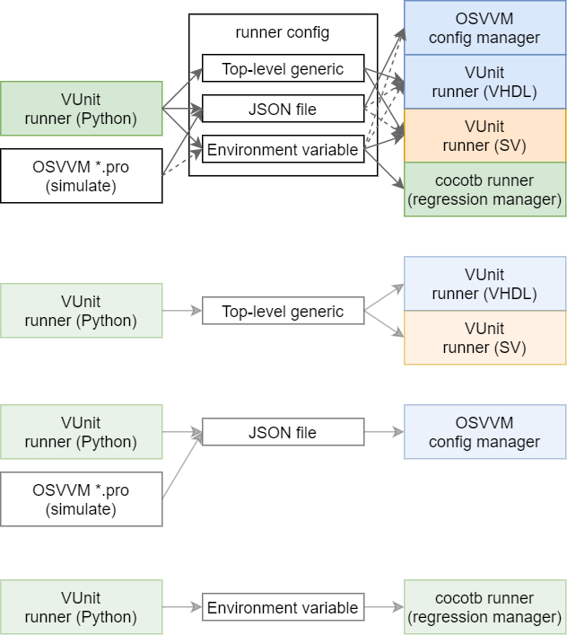

.. _API:Runner:

Runner
######

This section covers the interface for deciding which workflows to execute, whether to run the in parallel, which
specific parameters to use and how to interpret exit/termination codes of tools, as well as gathering/buffering the
stdout/stderr and partially processing it.
Therefore, the runner API is closely related to :ref:`API:Tool`, both of them belonging to layer 2 (Workflows) of
the :ref:`EDAA:Concept`.

In the case of VUnit, the runner is composed by sibling interfaces written in Python and HDL, due to the limitations in
some older revisions of VHDL to get the termination status.

*TBC*

  Strategies to pass the runner configuration from Python to HDL.

* :ghrepo:`VUnit/vunit#772 <VUnit/vunit/issues/772>`

References
==========

* :glrepo:`IEEE-P1076/VHDL-Issues#13: Python API <IEEE-P1076/VHDL-Issues/-/issues/13>`

* :web:`Test Anything Protocol <testanything.org/>`

  * :ghrepo:`python-tap/tappy`: a set of tools for working with the TAP in Python.

* :ghrepo:`FuseSoc Verification Automation (fsva) <m-kru/fsva>` is an HDL testbench runner based on
  :awesome:`FuseSoc <fusesoc>`.
  It fetches targets named with certain patterns in ``.core`` files; which can be executed in parallel; stdout/stderr
  are captured and parsed.

* :web:`ttask <www.p-code.org/ttask/index.html>`
