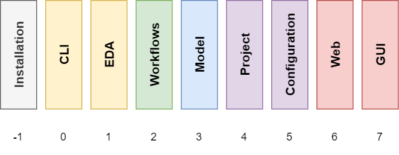

.. _OSVB:Model:

Conceptual Model
################

The OSVB Model is conceptual model for characterising the abstraction layers in Electronic Design Automation projects
based on Hardware Description Languages (HDL).
Its goal is the interoperability of diverse tools and languages with documented APIs.

.. IMPORTANT::
  This conceptual model is not meant to be an isolated full-stack, but each of the layers is to be useful and (re)usable.
  In fact, it is still being enhanced and reworked, so the naming and specific scope of the layers should be taken with
  a grain of salt.

   OSVB Model.

-1 | Installation
    Packaging and distribution of EDA tools.
    Organisation `github.com/hdl <https://github.com/hdl>`__ contains an index of packaging solutions (`hdl/packages <https://github.com/hdl/packages>`__),
    along with `hdl/smoke-tests <https://github.com/hdl/smoke-tests>`__ for packagers to test the artifacts.

0 | CLI
    Abstraction of Command-Line Interface programs (independent of EDA tools).

1 | EDA
    Interaction with EDA tools (both open source and vendors), including multiple version support, output
    filtering, etc.
    See :ref:`OSVB:API:Logging`.

2 | Workflows
    Middle layer to translate projects into execution steps (EDA and/or CLI).
    See :ref:`OSVB:API:Tool`.

3 | Model
    Syntax/design Document Object Model (DOM) of the language(s).
    See :ref:`OSVB:API:Project:pyVHDLModelUtils`.

4 | Project
    Tool independent information (files/filesets, primary design units, testbenches, `hdl/constraints <https://github.com/hdl/constraints>`__,
    etc.) and tool specific parameters.

5 | Configuration
    INI/JSON/YAML format for providing the data used in Workflow and/or Project through files, instead of using the APIs.
    See :ref:`OSVB:API:Core`.

6 | Web
    Web API wrapping the previous layers.

7 | GUI
    Visual frontend to the web API or to the previous layers.
    See :ref:`OSVB:API:Project:OSVDE`.

.. _OSVB:EDAA:

Electronic Design Automation Abstraction (EDA²)
===============================================

`IP Core Management Infrastructure (pyIPCMI) <https://github.com/Paebbels/pyIPCMI>`__, which was originally part of the
`Pile of Cores (PoC) <https://github.com/VLSI-EDA/PoC>`__ library, is a set of Python modules stacked on top of each other.
The core parts of pyIPCMI abstract the interaction with CLI tools and EDA tools (for simulation, synthesis, IP core
extraction/generation/packaging, ), as well as finding executables in multi-installation setups, post-processing of
outputs, etc.
However, similarly to other HDL/EDA management tools, pyIPCMI was conceived as a monolith.
That is, abstraction layers were written as a result of applying good coding and application development practices; not
necessarily with third-parties reusing them in mind.

Unfortunately, when pyIPCMI was developed INI files were used as the main user provided configuration file format, due
to usage of JSON and YAML not being widespread back then.
That didn't age well, as the INI format is rarely used in open source EDA projects.
Fortunately, the main developer of pyIPCMI is willing to rework the codebase, update it, and split the abstraction
layers explicitly to match the OSVB Model.
In fact, the OSVB Model is largely based on the expected outcome of reworking pyIPCMI.

Those modules are being reworked under the umbrella of Electronic Design Automation Abstraction (EDAA or EDA²):

* EDA² - CLI (`pyCLIAbstraction <https://github.com/Paebbels/pyCLIAbstraction>`__) [layer 0]
* EDA² - Tool [layer 1]
* EDA² - Project [layer 3]
* EDA² - VHDLModel (`pyVHDLModel <https://github.com/vhdl/pyVHDLModel>`__) [layer 5]

Integration with existing projects
==================================

The following projects are all written in Python and were all created and developed during the last decade:

* PoC (2014)
* VUnit (2014)
* Edalize (2018), split from FuseSoC (2011)
* pyFPGA (2019), based on fpga_helpers (2015)
* Xeda (2020)

All of them implement multiple of the layers in the OSVB Model, however, most of them were not written with reusabillity
in mind.
Hopefully, maintainers of those projects will be willing to isolate the reusable pieces of their codebases, so they can
focus their effort on the features unique to their solution.
The following is our wishlist:

* VUnit

  * Switching simulator with an environment variable.
  * Wildcards support and as-easy-as-possible API for defining filesets (sources, libs, etc.).
  * Dependency scanning and incremental compilation.

    * Dependency scanning features might be provided by pyVHDLModelUtils, instead of having it implemented in VUnit's
      codebase.

  * Integration between Python and the HDL runner.

    * Interpretation of what a success/failure is (specific for each VHDL revision).
    * Definition of multiple tests in VHDL and management of which to execute.
    * Complex generics, JSON-for-VHDL, configurations, etc.

* FuseSoC/Edalize

  * ``.core`` file format and all the projects which use it already.
  * Specific know-how about the less mainstream toolchains.
  * Support for fine-grained containers.

* pyFPGA

  * Similarly to fusesoc/edalize, specific know-how about some toolchains/flows and support for fine-grained containers.
  * Easy Python API for defining the sources, libs, targets, etc. for synthesis.

* PoC/pyIPCMI

  * Abstraction for EDA tool tasks.
  * Abstraction for post-processing the logs.
  * Abstraction of a Project.

* Xeda (to be analysed yet)
